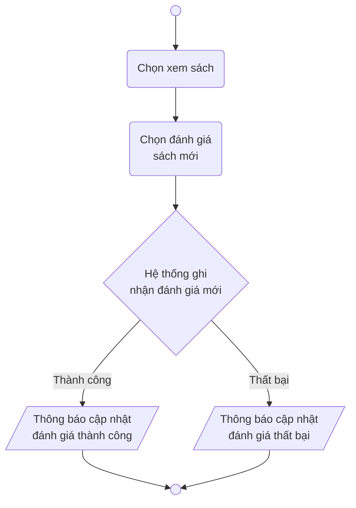
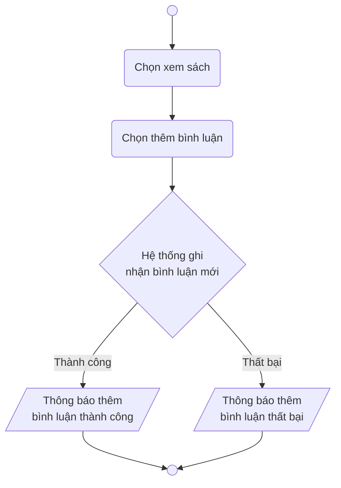
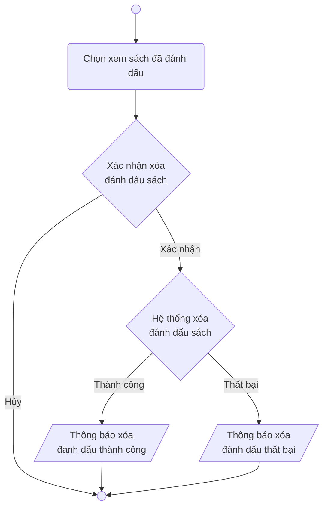
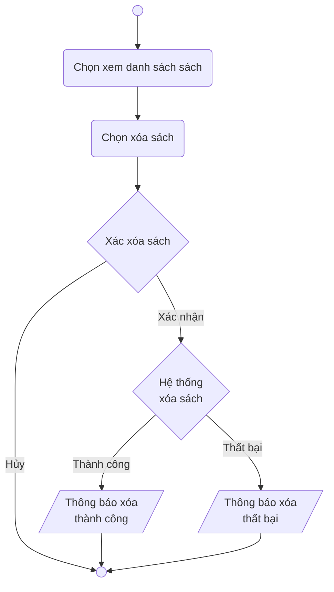

## Thay đổi đánh giá sách

```mermaid
flowchart
    _(( ))
    Z(( ))

    _ --> A(Chọn xem sách)
    A --> B(Chọn đánh giá <br> sách mới)
    B --> C{Hệ thống ghi <br> nhận đánh giá mới}
    C -- Thành công --> D[/Thông báo cập nhật <br> đánh giá thành công/]
    C -- Thất bại --> E[/Thông báo cập nhật <br> đánh giá thất bại/]
    D --> Z
    E --> Z
```
## Thêm bình luận

```mermaid
flowchart
    _(( ))
    Z(( ))

    _ --> A(Chọn xem sách)
    A --> B(Chọn thêm bình luận)
    B --> C{Hệ thống ghi <br> nhận bình luận mới}
    C -- Thành công --> D[/Thông báo thêm <br> bình luận thành công/]
    C -- Thất bại --> E[/Thông báo thêm <br> bình luận thất bại/]
    D --> Z
    E --> Z
```
## Thay đổi đánh giá sách

```mermaid
flowchart
    _(( ))
    Z(( ))

    _ --> A(Chọn xem sách đã đánh dấu)
    A --> B{Xác nhận xóa <br> đánh dấu sách}
    B -- Hủy --> Z
    B -- Xác nhận --> C{Hệ thống xóa <br> đánh dấu sách}
    C -- Thành công --> D[/Thông báo xóa <br> đánh dấu thành công/]
    C -- Thất bại --> E[/Thông báo xóa <br> đánh dấu thất bại/]
    D --> Z
    E --> Z
```

## Thêm sách

```mermaid
flowchart
    _(( ))
    Z(( ))

    _ --> F(Chọn xem danh sách sách)
    F --> A(Chọn xóa sách)
    A --> B{Xác xóa sách}
    B -- Hủy --> Z
    B -- Xác nhận --> C{Hệ thống <br> xóa sách}
    C -- Thành công --> D[/Thông báo xóa <br> thành công/]
    C -- Thất bại --> E[/Thông báo xóa <br> thất bại/]
    D --> Z
    E --> Z
```
