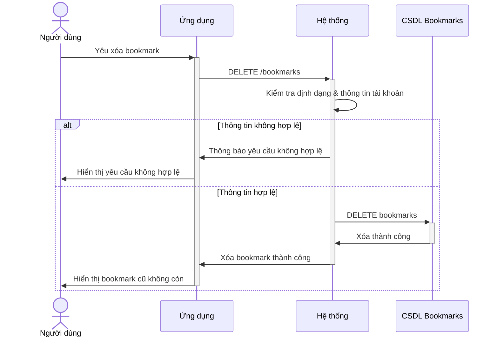

```mermaid
sequenceDiagram
    Actor A as Người dùng
    participant B as Ứng dụng
    participant C as Hệ thống
    participant D as CSDL Bookmarks

    A ->>+ B: Yêu xóa bookmark
    B ->>+ C: DELETE /bookmarks
    C ->> C: Kiểm tra định dạng & thông tin tài khoản
    alt Thông tin không hợp lệ
        C ->> B: Thông báo yêu cầu không hợp lệ
        B ->> A: Hiển thị yêu cầu không hợp lệ
    else Thông tin hợp lệ
        C ->>+ D: DELETE bookmarks
        D ->>- C: Xóa thành công
        C ->>- B: Xóa bookmark thành công
        B ->>- A: Hiển thị bookmark cũ không còn
    end
```
