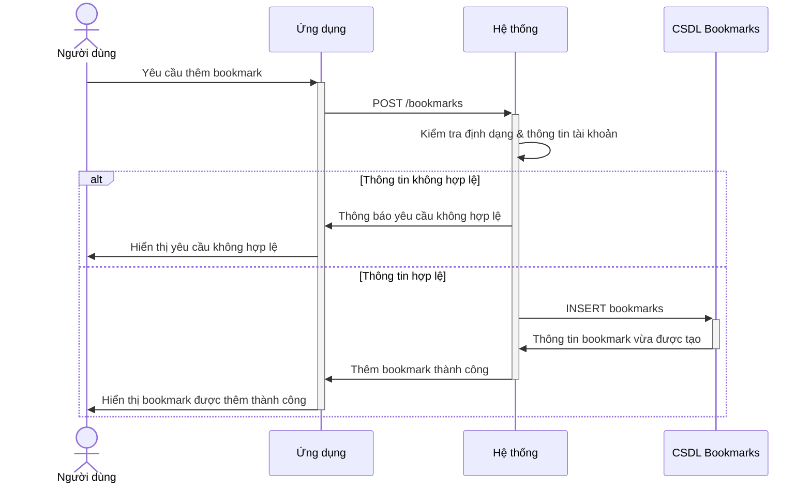

```mermaid
sequenceDiagram
    Actor A as Người dùng
    participant B as Ứng dụng
    participant C as Hệ thống
    participant D as CSDL Bookmarks

    A ->>+ B: Yêu cầu thêm bookmark
    B ->>+ C: POST /bookmarks
    C ->> C: Kiểm tra định dạng & thông tin tài khoản
    alt Thông tin không hợp lệ
        C ->> B: Thông báo yêu cầu không hợp lệ
        B ->> A: Hiển thị yêu cầu không hợp lệ
    else Thông tin hợp lệ
        C ->>+ D: INSERT bookmarks
        D ->>- C: Thông tin bookmark vừa được tạo
        C ->>- B: Thêm bookmark thành công
        B ->>- A: Hiển thị bookmark được thêm thành công
    end
```
