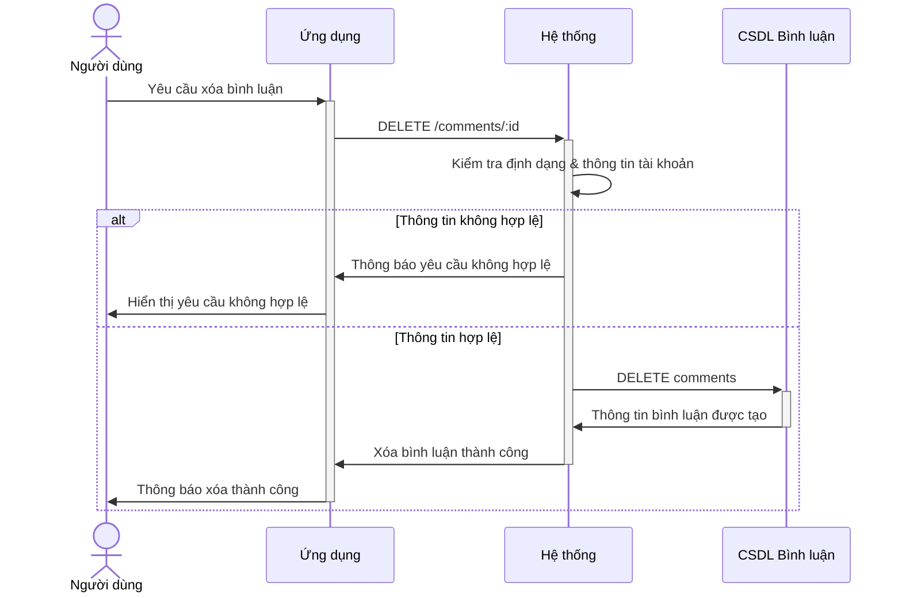

```mermaid
sequenceDiagram
    Actor A as Người dùng
    participant B as Ứng dụng
    participant C as Hệ thống
    participant D as CSDL Bình luận

    A ->>+ B: Yêu cầu xóa bình luận

    B ->>+ C: DELETE /comments/:id
    C ->> C: Kiểm tra định dạng & thông tin tài khoản
    alt Thông tin không hợp lệ
        C ->> B: Thông báo yêu cầu không hợp lệ
        B ->> A: Hiển thị yêu cầu không hợp lệ
    else Thông tin hợp lệ
        C ->>+ D: DELETE comments
        D ->>- C: Thông tin bình luận được tạo
        C ->>- B: Xóa bình luận thành công
        B ->>- A: Thông báo xóa thành công
    end
```
