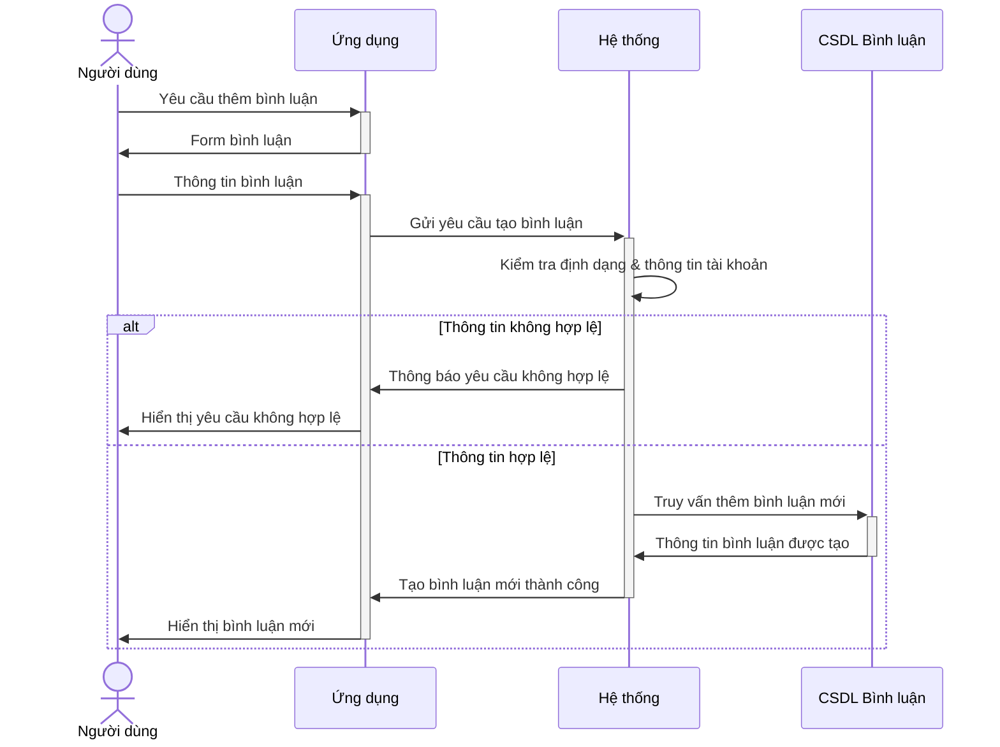

```mermaid
sequenceDiagram
    Actor A as Người dùng
    participant B as Ứng dụng
    participant C as Hệ thống
    participant D as CSDL Bình luận

    A ->>+ B: Yêu cầu thêm bình luận
    B ->>- A: Form bình luận

    A ->>+ B: Thông tin bình luận

    B ->>+ C: Gửi yêu cầu tạo bình luận
    C ->> C: Kiểm tra định dạng & thông tin tài khoản
    alt Thông tin không hợp lệ
        C ->> B: Thông báo yêu cầu không hợp lệ
        B ->> A: Hiển thị yêu cầu không hợp lệ
    else Thông tin hợp lệ
        C ->>+ D: Truy vấn thêm bình luận mới
        D ->>- C: Thông tin bình luận được tạo
        C ->>- B: Tạo bình luận mới thành công
        B ->>- A: Hiển thị bình luận mới
    end
```
