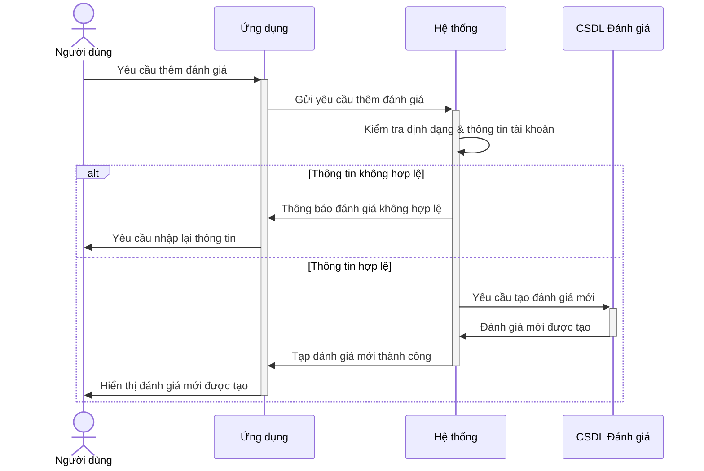

```mermaid
sequenceDiagram
    Actor A as Người dùng
    participant B as Ứng dụng
    participant C as Hệ thống
    participant D as CSDL Đánh giá

    A ->>+ B: Yêu cầu thêm đánh giá

    B ->>+ C: Gửi yêu cầu thêm đánh giá
    C ->> C: Kiểm tra định dạng & thông tin tài khoản
    alt Thông tin không hợp lệ
        C ->> B: Thông báo đánh giá không hợp lệ
        B ->> A: Yêu cầu nhập lại thông tin
    else Thông tin hợp lệ
        C ->>+ D: Yêu cầu tạo đánh giá mới
        D ->>- C: Đánh giá mới được tạo
        C ->>- B: Tạp đánh giá mới thành công
        B ->>- A: Hiển thị đánh giá mới được tạo
    end
```
