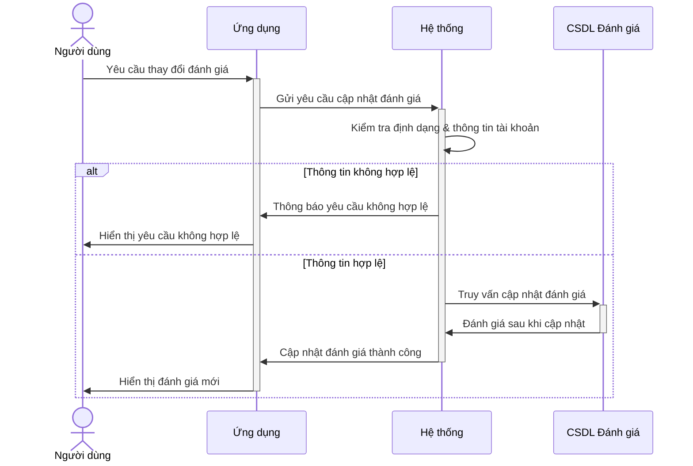

```mermaid
sequenceDiagram
    Actor A as Người dùng
    participant B as Ứng dụng
    participant C as Hệ thống
    participant D as CSDL Đánh giá

    A ->>+ B: Yêu cầu thay đổi đánh giá

    B ->>+ C: Gửi yêu cầu cập nhật đánh giá
    C ->> C: Kiểm tra định dạng & thông tin tài khoản
    alt Thông tin không hợp lệ
        C ->> B: Thông báo yêu cầu không hợp lệ
        B ->> A: Hiển thị yêu cầu không hợp lệ
    else Thông tin hợp lệ
        C ->>+ D: Truy vấn cập nhật đánh giá
        D ->>- C: Đánh giá sau khi cập nhật
        C ->>- B: Cập nhật đánh giá thành công
        B ->>- A: Hiển thị đánh giá mới
    end
```
