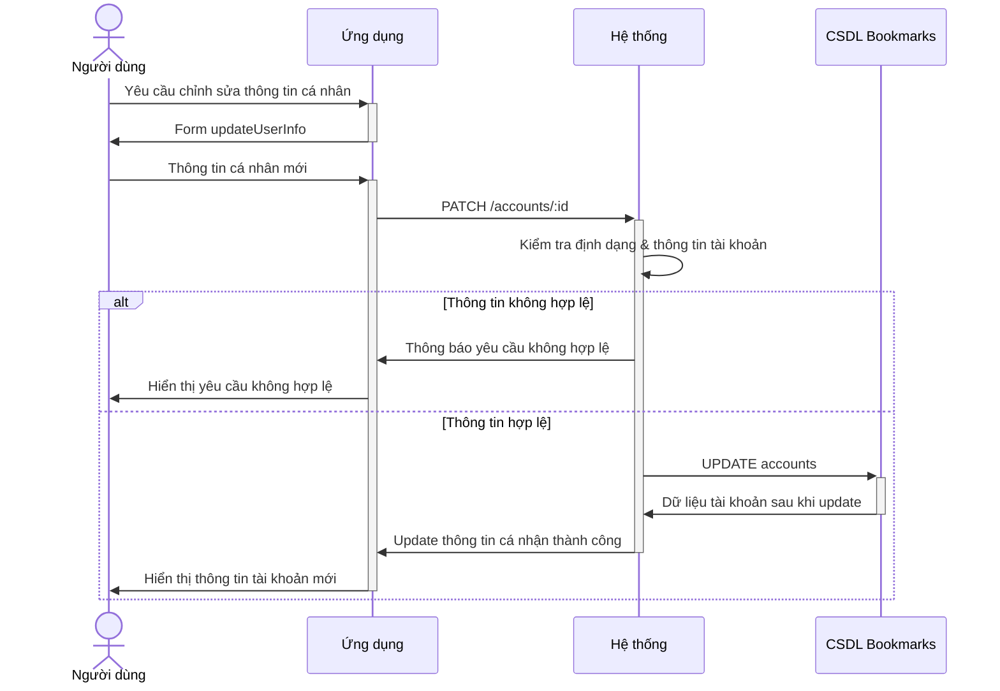

```mermaid
sequenceDiagram
    Actor A as Người dùng
    participant B as Ứng dụng
    participant C as Hệ thống
    participant D as CSDL Bookmarks

    A ->>+ B: Yêu cầu chỉnh sửa thông tin cá nhân
    B ->>- A: Form updateUserInfo

    A ->>+ B: Thông tin cá nhân mới
    B ->>+ C: PATCH /accounts/:id
    C ->> C: Kiểm tra định dạng & thông tin tài khoản
    alt Thông tin không hợp lệ
        C ->> B: Thông báo yêu cầu không hợp lệ
        B ->> A: Hiển thị yêu cầu không hợp lệ
    else Thông tin hợp lệ
        C ->>+ D: UPDATE accounts
        D ->>- C: Dữ liệu tài khoản sau khi update
        C ->>- B: Update thông tin cá nhận thành công
        B ->>- A: Hiển thị thông tin tài khoản mới
    end
```
