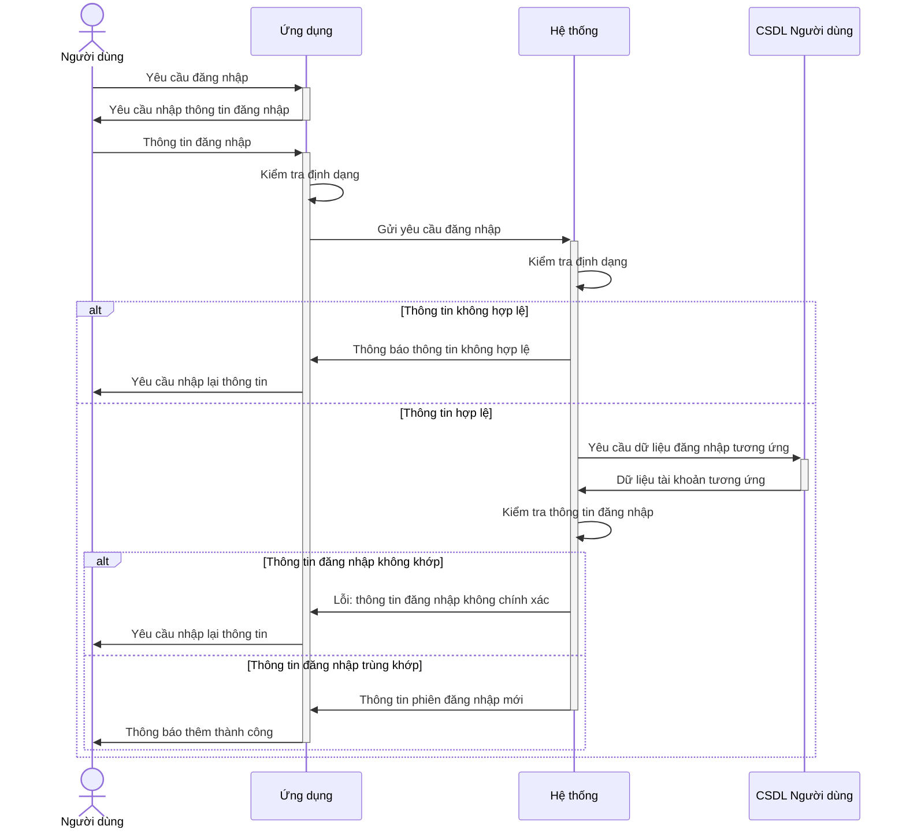

## Đăng ký

```mermaid
sequenceDiagram
    Actor A as Người dùng
    participant B as Ứng dụng
    participant C as Hệ thống
    participant D as CSDL Người dùng

    A ->>+ B: Yêu cầu đăng nhập
    B ->>- A: Yêu cầu nhập thông tin đăng nhập

    A ->>+ B: Thông tin đăng nhập
    B ->> B: Kiểm tra định dạng
    B ->>+ C: Gửi yêu cầu đăng nhập
    C ->> C: Kiểm tra định dạng

    alt Thông tin không hợp lệ
        C ->> B: Thông báo thông tin không hợp lệ
        B ->> A: Yêu cầu nhập lại thông tin
    else Thông tin hợp lệ
        C ->>+ D: Yêu cầu dữ liệu đăng nhập tương ứng 
        D ->>- C: Dữ liệu tài khoản tương ứng
        C ->> C: Kiểm tra thông tin đăng nhập
        alt Thông tin đăng nhập không khớp
            C ->> B: Lỗi: thông tin đăng nhập không chính xác
            B ->> A: Yêu cầu nhập lại thông tin
        else Thông tin đăng nhập trùng khớp
            C ->>- B: Thông tin phiên đăng nhập mới
            B ->>- A: Thông báo thêm thành công
        end
    end
```
## 